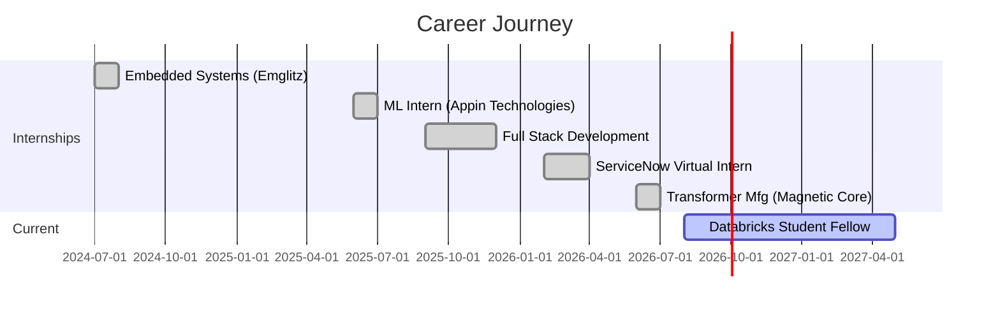

---

## 🧑‍💻 About Me

```yaml
name: Sankar Saravanakumar
location: Salem, Tamil Nadu 📍
education: B.E. ECE (2023–2027) @ SNS College of Engineering, Coimbatore
current_role: Databricks Student Fellow | Student Placement Coordinator
tagline: Crafting Intelligent Cloud Solutions ☁️

currently_building:
  - 🤖 AI DSA Problem Recommender (AWS Bedrock + Lambda)
  - 🎯 SOP Proctored Exam Portal
  - 📰 Daily Tech Digest Agent (Serverless)

exploring:
  - Agentic AI & LLM Orchestration
  - Serverless Architectures on AWS
  - Cloud-Native DevOps Pipelines
  - MLOps & Model Deployment

fun_fact: "I organized AWS Certification sessions for 100+ students 🎓"

```

---

## 🏆 Certifications Wall

### ☁️ Amazon Web Services (5x Certified)


  


  


  


  


**SAA-C03**           **MLA-C01**           **SOA-C02**           **AIF-C01**           **CLF-C02** ### 🔷 Microsoft  |  🟢 Salesforce  |  ❄️ SnowPro  |  🔴 Oracle  |  🎩 RedHat AI


### 🏅 Award


---

## 🛠️ Tech Arsenal

### ☁️ Cloud & DevOps


 ### 🤖 AI / ML / Data


 ### 💻 Software Development


 ### 🗄️ Databases & Tools


---

## 🚀 Featured Projects

| ### 🤖 [AI DSA Recommender](https://github.com/Sankar2316) AI-powered DSA practice engine — identifies weak topics & recommends daily problems `Amazon Bedrock` `Lambda` `DynamoDB` `S3` | ### 📰 [Daily Tech Digest Agent](https://github.com/Sankar2316/daily-tech-digest-agent) Always-on serverless agent — fetches RSS, summarizes with AI & emails daily digest `EventBridge` `Lambda` `Bedrock` `SES` |
| --- | --- |
| ### 🎯 [SOP Proctored Exam Portal](https://github.com/Sankar2316) Secure online proctoring platform with AI-powered monitoring `Node.js` `React` `AWS` | ### 🧠 [AI Resume Analyzer](https://github.com/Sankar2316) Smart resume parsing & scoring with AI `Python` `NLP` `AWS Textract` |
| ### 📊 [SmartPriority](https://github.com/Sankar2316/smart-priority) AI-powered task prioritization with cloud-native architecture `AWS Amplify` `Lambda` `Bedrock Nova Lite` | ### 💰 [Expense Sorter](https://github.com/Sankar2316) Automated receipt processing & expense categorization `AWS Textract` `Bedrock` `S3` |
| ### 🔗 [URL Shortener](https://github.com/Sankar2316) Custom URL shortening with click analytics dashboard `React` `Node.js` `Express` | ### 🌌 [NASA APOD MCP Server](https://github.com/Sankar2316) MCP server for NASA's Astronomy Picture of the Day `TypeScript` `MCP SDK` |
| ### 🎮 [Trivia Quiz MCP Server](https://github.com/Sankar2316/trivia-mcp-server) MCP server — Open Trivia DB — 4000+ questions `TypeScript` `MCP SDK` | ### 🐾 [Pokémon MCP Server](https://github.com/Sankar2316) MCP server connecting to PokéAPI — 6 tools for Pokémon data `TypeScript` `MCP SDK` |
| ### 📡 [WiFi People Monitoring](https://github.com/Sankar2316) WiFi-based indoor location tracking & people monitoring system `Python` `Signal Processing` `IoT` | ### 🏠 [Landing Page Generator](https://github.com/Sankar2316) AI-powered landing page creation from one-line descriptions `JavaScript` `AI` |

---

## 📊 GitHub Analytics


---

## 🏆 GitHub Trophies


---

## 🐍 Contribution Snake


---

## 🌐 Community & Leadership

| Role | Organization | Period |
| --- | --- | --- |
| 🎓 **Student Fellow** | Databricks | Aug 2026 – Present |
| 🛠️ **Organizing Team Member** | AWS User Group Madurai | Active |
| 📋 **Student Placement Coordinator** | SNS College of Engineering | Active |
| 🏆 **AWS AI & ML Scholars Program** | Amazon Web Services | Completed |
| 🎤 **AWS Certification Awareness** | Organized for 100+ Students | Completed |
| 🏅 **AWS Summit & Community Day** | Bengaluru | Attended |

---

## 💼 Experience Timeline



---

## 📫 Let's Connect & Build Together


 


 


 


### 💡 *"The only way to do great work is to love what you do."* — Steve Jobs ⭐ **If you found my profile interesting, consider giving a star to my repos!** ⭐


